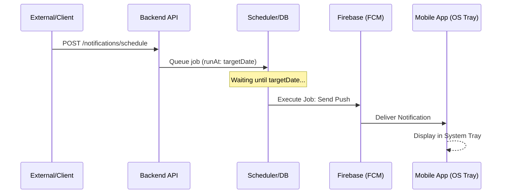
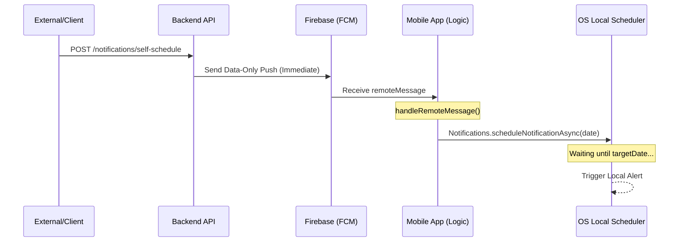

# Geolocation Notification POC

This project demonstrates a hybrid notification scheduling system using a **Bun/Elysia** backend and a **React Native (Expo)** mobile application. It showcases two primary ways to handle scheduled notifications: Backend-side scheduling and Client-side (Self) scheduling.

## Architecture Overview

The system consists of two main components:
- **`backend-services`**: A Bun-powered API using Elysia, Drizzle ORM, and a background task scheduler.
- **`mobileapp`**: An Expo-based React Native app integrated with Firebase Cloud Messaging (FCM) and Expo Notifications.

### Flow Diagrams

#### 1. Backend-Scheduled Flow
The backend handles the delay. The device receives the notification exactly when it should be displayed.



#### 2. Client-Scheduled (Self-Schedule) Flow
The backend sends the data immediately. The device handles the delay locally via hardware alarms.



---

## Notification Flows

There are two distinct paths for delivering notifications based on where the "scheduling logic" lives.

### 1. Backend-Scheduled Notifications
In this flow, the backend retains control over when the notification is actually dispatched to Firebase.

**Process:**
1.  **Request:** A client or system triggers `POST /notifications/schedule` on the backend.
2.  **Scheduling:** The backend calculates a `jobId` and uses an internal `scheduler` to queue a `send-push-notification` task for the specific `sendAt` timestamp.
3.  **Execution:** When the scheduled time arrives, the backend worker executes the job and sends the FCM message to the device.
4.  **Delivery:** The mobile app receives the notification immediately via the system tray (standard FCM behavior).

**Endpoint:** `POST /notifications/schedule`
```json
{
  "token": "FCM_TOKEN",
  "title": "Hello!",
  "msgBody": "This was scheduled on the server.",
  "sendAt": "2026-03-13T12:00:00Z"
}
```

### 2. Client-Scheduled (Self-Schedule) Notifications
In this flow, the backend sends an immediate instruction to the app, and the app schedules the local notification on the device's hardware.

**Process:**
1.  **Request:** Trigger `POST /notifications/self-schedule` on the backend.
2.  **Trigger:** The backend immediately sends a data-only FCM message containing the notification content and the target `time`.
3.  **App Interception:** The mobile app's `setBackgroundMessageHandler` or foreground listener (`handleRemoteMessage`) receives the message.
4.  **Local Scheduling:** 
    *   The app checks if `remoteMessage.data.type === 'self-schedule'`.
    *   It uses `Notifications.scheduleNotificationAsync` (from `expo-notifications`) to schedule a local alert at the requested `time`.
5.  **Delivery:** The device triggers the notification locally at the exact time, even if it loses internet connection after the initial trigger.

**Endpoint:** `POST /notifications/self-schedule`
```json
{
  "token": "FCM_TOKEN",
  "title": "Reminder",
  "msgBody": "The app scheduled this locally!",
  "timezone": "Asia/Jakarta",
  "time": "14:30:00"
}
```

---

## Technical Implementation Details

### Mobile App (`@mobileapp/App.tsx`)
- **FCM Integration:** Uses `@react-native-firebase/messaging` to retrieve tokens and listen for incoming messages.
- **Background Handling:** `messaging().setBackgroundMessageHandler(handleRemoteMessage)` ensures "self-schedule" triggers are processed even when the app is closed.
- **Local Notifications:** `expo-notifications` is used to interface with the device's native alarm/notification system for precise local timing.

### Backend Service (`@backend-services/src`)
- **API Framework:** Built with **Elysia** for high-performance TypeScript execution on Bun.
- **Notification Controller:** 
    - `/schedule`: Interacts with a custom `scheduler` plugin (likely backed by a database like PostgreSQL via Drizzle).
    - `/self-schedule`: Interacts directly with `firebase.sendPush` to deliver the scheduling instruction to the client.
- **Registry:** Uses a central registry pattern (`src/registry.ts`) to inject dependencies like the `scheduler` and `firebase` service into controllers.

## Getting Started

### Backend
```bash
cd backend-services
bun install
bun run dev
```

### Mobile App
```bash
cd mobileapp
bun install
# For Android
bun expo run:android
# For iOS
bun expo run:ios
```
